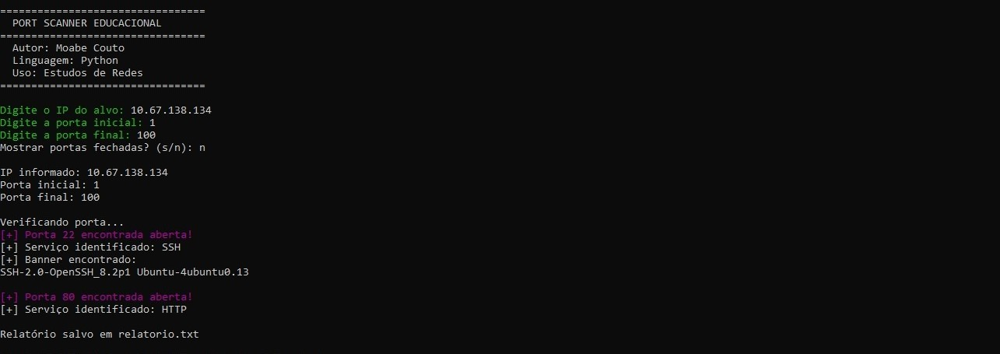

# 🔎 Port Scanner Educacional

Ferramenta de scanner de portas desenvolvida em **Python** com objetivo educacional para estudos de **Redes de Computadores, Segurança da Informação e Cibersegurança**.

O projeto realiza uma varredura em um endereço IP informado pelo usuário, identificando portas abertas e possíveis serviços disponíveis.

---

## 🚀 Funcionalidades

✅ Scanner de portas TCP  
✅ Entrada de IP do alvo pelo terminal  
✅ Identificação de portas abertas  
✅ Exibição dos serviços encontrados  
✅ Geração de relatório automático em arquivo `.txt`  
✅ Interface simples pelo terminal  
✅ Código desenvolvido em Python puro

---

## 🛠️ Tecnologias utilizadas

- Python 3
- Biblioteca Socket
- Sistema operacional Windows/Linux

---

## 📌 Como executar

No terminal:

```bash
python scanner.py

md
## 📷 Demonstração

Execução da ferramenta:


